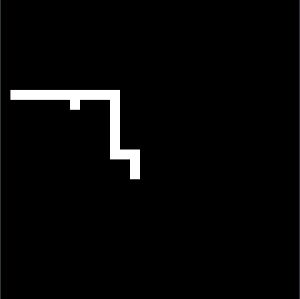

  

# Snake #
A graphical game of Snake. Uses a block of pixels as a pixel in the game. 
Very simple game that I coded over a few days because I was bored. 

### Rules ###
* https://en.wikipedia.org/wiki/Snake_(video_game)
* Use WSAD to move around the map
* You lose if you eat yourself or run off the map

## Prerequisites ##
Make sure you have the SDL libs installed. Please modify the Makefile in the root folder to reflect the directory you have SDL installed. 

## Installation ##
Please use `<make> ./bin/make.exe` to compile the program when debugging.  
You can also use `<make> install` to compile the final (optimized) program.

## Usage ##
See Installation. If you used `<make> ./bin/make.exe` to compile, the program is
in the `bin` directory. If you used `<make> install`, then the game should automatically
run. If you want to play again, run the `Play.exe` in the root folder

## Built with ##
#### SDL 2.0 ####
* https://www.libsdl.org/  
* https://www.libsdl.org/download-2.0.php

## Contributing ##
1. Fork it!
2. Create your feature branch: `git checkout -b my-new-feature`
3. Commit your changes: `git commit -am 'Add some feature'`
4. Push to the branch: `git push origin my-new-feature`
5. Submit a pull request :D

## Authors ##
* **Aryan Gupta**

## License ##
Copyright (c) 2017 The Gupta Empire - All Rights Reserved

